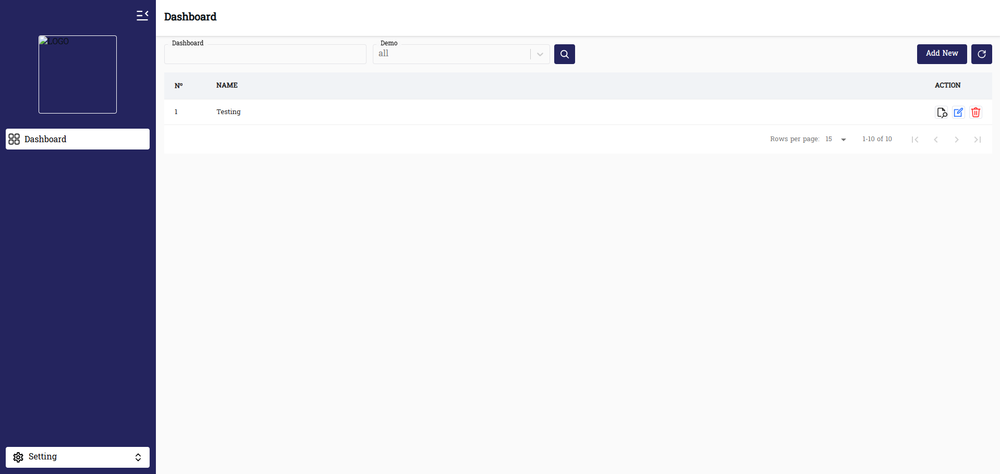
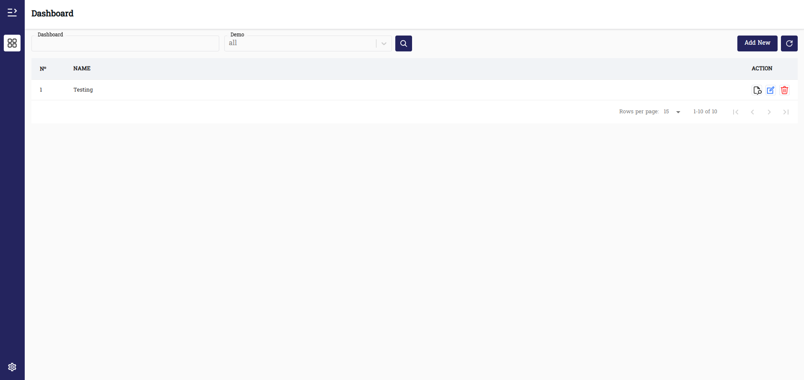
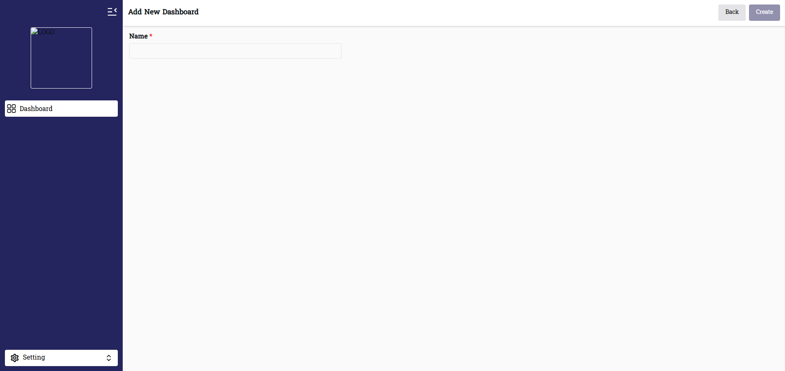
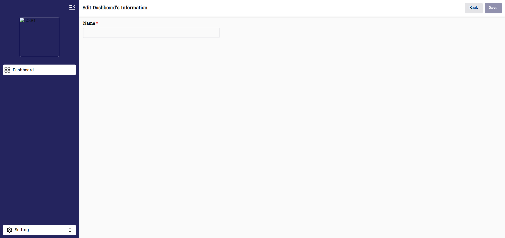
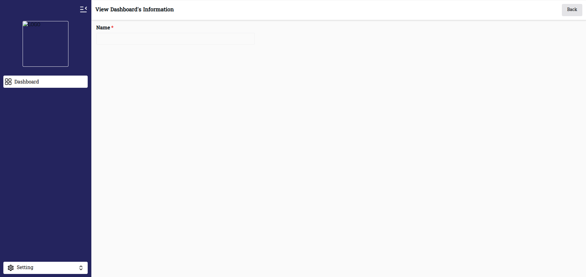

# 🛠️ Admin Dashboard Template

A reusable **Admin Dashboard Template** built with modern React + Vite + TypeScript.  
Easily customizable with environment variables and constants.

---

## 🚀 Tech Stack

- [React 19](https://react.dev/) – UI Library
- [Vite 7](https://vitejs.dev/) – Build tool
- [TypeScript 5](https://www.typescriptlang.org/) – Type-safe development
- [Chakra UI 3](https://chakra-ui.com/) – UI Components
- [Framer Motion](https://www.framer.com/motion/) – Animations
- [React Router 7](https://reactrouter.com/) – Routing
- [TanStack Query 5](https://tanstack.com/query) – Data fetching / caching
- [React Hook Form](https://react-hook-form.com/) – Forms
- [React Data Table Component](https://www.npmjs.com/package/react-data-table-component) – Data table
- [i18next](https://www.i18next.com/) + [react-i18next](https://react.i18next.com/) – Multi-language support
- [Moment.js](https://momentjs.com/) – Date utilities
- [Styled Components](https://styled-components.com/) – Styling
- [React Icons](https://react-icons.github.io/react-icons/) – Icons
- [CryptoJS](https://www.npmjs.com/package/crypto-js) – Encryption/Decryption

---

## 📂 Project Structure

```bash
src/
├── assets/ # Fonts, icons, images, languages (for translation)
│ ├── fonts/
│ ├── icons/
│ ├── imgs/
│ └── languages/
│
├── components/ # Reusable components
│ ├── dialogs/
│ ├── LoadingComponent/
│ ├── ui/
│ └── views/
│
├── constants/ # Global constants (colors, pagination, styles, etc.)
│ ├── app.tsx
│ └── styles.tsx
│
├── layouts/ # Layout components (sidebar, navbar, etc.)
├── libs/ # Library wrappers/helpers
├── types/ # TypeScript types/interfaces
├── utils/ # Utility functions
│
├── views/ # Feature-based views (login, etc.)
│ └── auth/
│
├── pages/ # Page-level components
│ └── dashboard/
│ ├── DashboardAddNew.tsx
│ ├── DashboardEdit.tsx
│ ├── DashboardView.tsx
│ └── index.tsx
│
├── App.tsx # Main App entry
├── router.tsx # App routes
├── theme.ts # Theme overrides
├── i18next.tsx # i18n setup
├── index.tsx # ReactDOM render entry
├── index.css # Global styles
└── main.tsx # App
```
---

## ⚙️ Environment Variables

Defined in `.env.development` and `.env.production`:

```bash
# .env.development
VITE_APP_API_URL=
VITE_APP_NAME=template-admin-dev
VITE_APP_SECRET=template-admin-dev-secret
VITE_PAGINATION_PER_PAGE=15
```

VITE_APP_API_URL → Backend API endpoint

VITE_APP_NAME → Application name

VITE_APP_SECRET → App secret key

VITE_PAGINATION_PER_PAGE → Default rows per page in tables

---

## 🎨 Customization

App constants are in /src/constants/app.tsx:

export const BG_SIDEBAR = "#24245e"; // Sidebar background
export const PRIMARY_COLOR = "#24245e"; // Primary theme color
export const APP_NAME = import.meta.env.VITE_APP_NAME;
export const APP_SECRET = import.meta.env.VITE_APP_SECRET;
export const paginationPerPage = Number(import.meta.env.VITE_PAGINATION_PER_PAGE) || 15;

👉 To change sidebar background → edit BG_SIDEBAR
👉 To change pagination size → edit .env

---

## 🖥️ Development

# Install dependencies

yarn install

# Run development server

yarn dev

# Build production

yarn build

# Preview production build

yarn preview

---

## 📌 Features

✅ Reusable admin dashboard

✅ Environment-driven configuration

✅ Multi-language (English + Khmer ready)

✅ Data table with pagination

✅ Sidebar layout system

✅ Reusable form and UI components

✅ Easy theme customization via constants

---

## 📸 Screenshots







## Created

30 September 2025 by Sok Sovannarith
